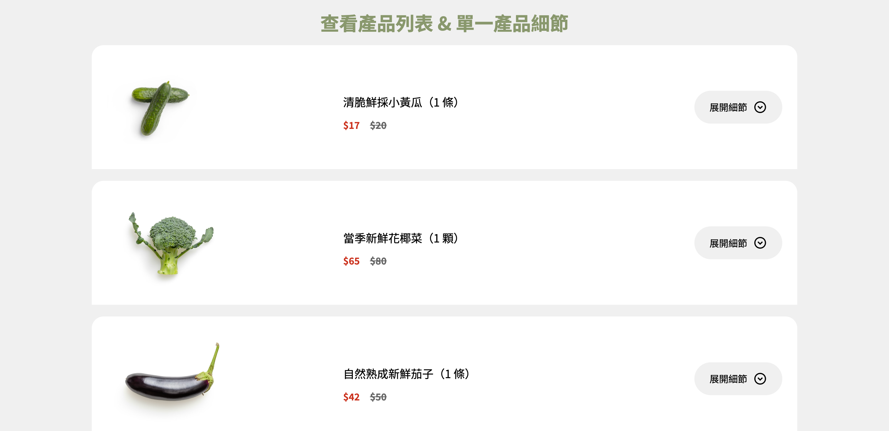
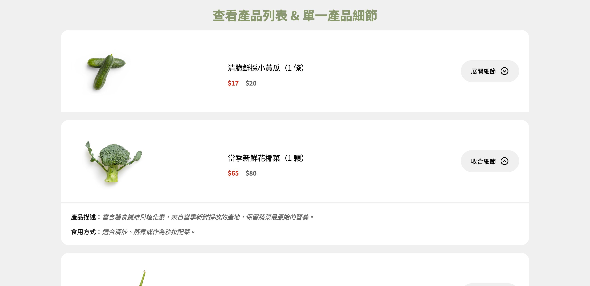

# Week 1 - Mission

  [Week1 頁面連結](https://pengpon.github.io/react-training-2025/week1/)

## 開發
- 使用 Vite 建立 React 專案樣板
- sass 撰寫 CSS 樣式
- 透過 axios 取得 `ec-course-api.hexschool.io/v2/api` API 資料

### 畫面參考
參考 ezTravel 航班列表呈現方式，如下圖：


每筆航班可點擊【航班資訊】展開/收合 內容資訊

## 功能
- 使用者可查看產品列表
- 使用者點擊【展開細節】按鈕，可顯示該項產品細節
- 展開產品細節後，可再點擊【收合細節】按鈕，收合資訊

## 開發 & 打包部署
`node 使用 v24.12.0`
```bash
# 進入 week1 目錄下

# 安裝 package
npm install

# 啟動本機 Server
npm run dev

# 打包產生靜態檔 dist
npm run build

# 打包並部署至遠端 gh-pages 分支
npm run deploy
```

## 畫面截圖

產品列表




展開單一產品內容資訊



