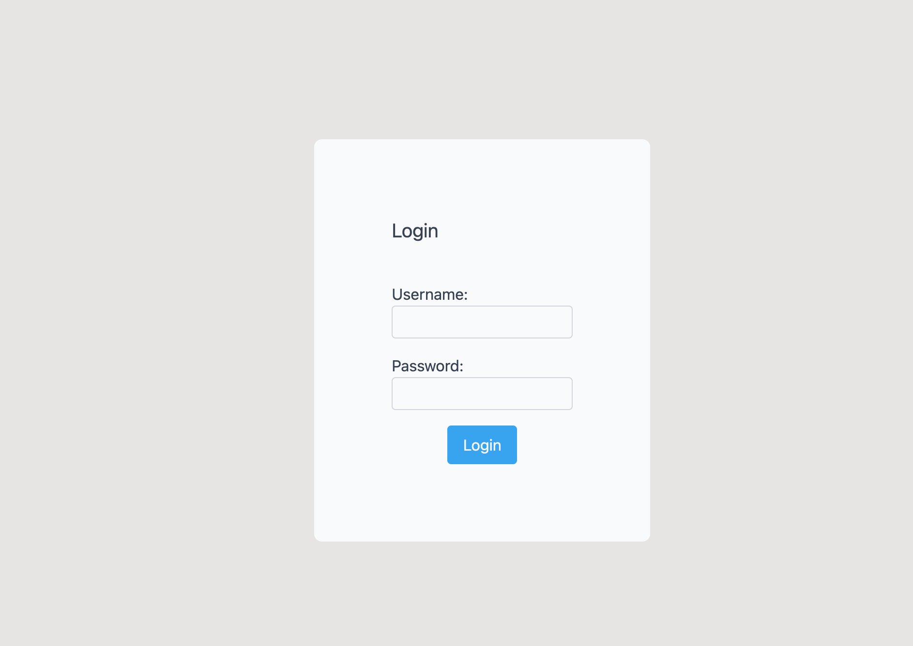
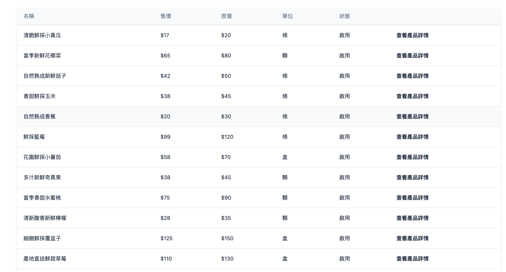
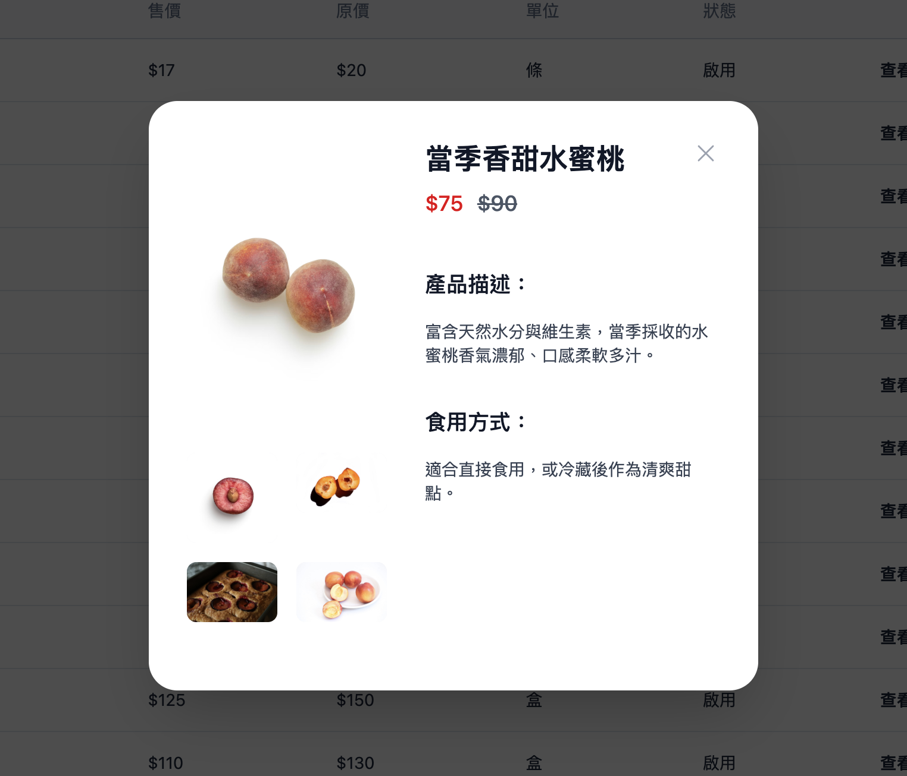
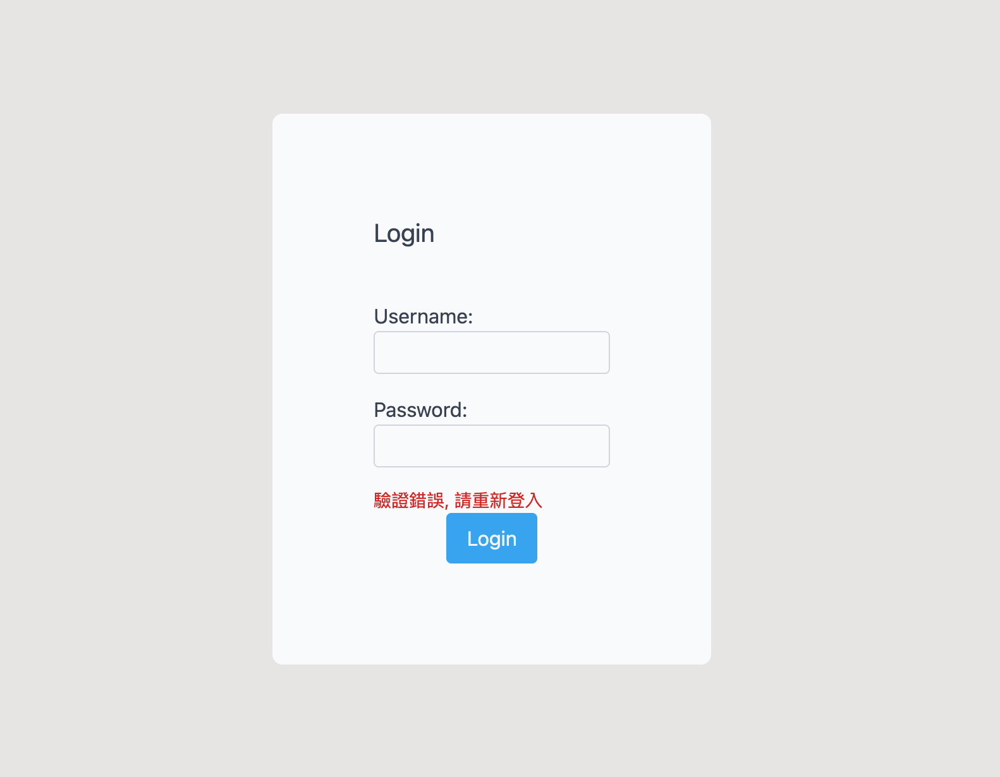
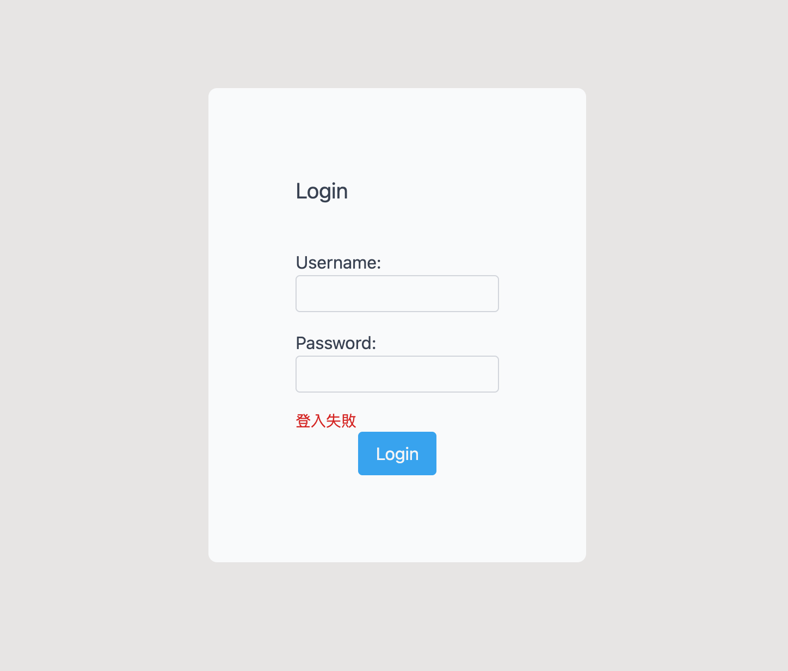

# Week 2 - Mission

  [Week2 頁面連結](https://pengpon.github.io/react-training-2025/week2/)

## 需求
```bash
請使用 vite 完成以下需求：

- 使用者可以從登入頁面登入，並轉到後台商品頁面
- 使用者若無登入直接進入商品頁面，會被導回登入頁面
- 使用者可以查看產品列表
- 使用者可以點擊單一產品，查看詳細資訊
```

## 功能
＊尚未使用路由，僅使用 state 判斷頁面該顯示的元件

- 後台管理者可進入[後台登入頁](https://pengpon.github.io/react-training-2025/week2/)
- 若登入成功或是 cookie 存有有效的 Token，進入[後台登入頁](https://pengpon.github.io/react-training-2025/week2/)會直接顯示產品列表
- 點擊單一產品『查看產品詳情』，會開啟 Modal 顯示產品描述、食用方式...等資訊
- 進入[後台登入頁](https://pengpon.github.io/react-training-2025/week2/)時，若 cookie 中所存的 Token 無效，會顯示 Login 表單讓後台管理者重新輸入 Email、Password 重新登入


## 開發
- 使用 Vite 建立 React 專案樣板
- Tailwind CSS 撰寫 CSS 樣式

## 安裝 & 打包部署
`node 使用 v24.12.0`
```bash
# 進入 week2 目錄下
cd week2

# 安裝 package
npm install

# 啟動本機 Server
npm run dev

# 只打包產生靜態檔 dist
npm run build

# 打包並部署至遠端 gh-pages 分支
npm run deploy
```

## 畫面截圖

登入



產品列表



產品詳情



----

驗證錯誤



登入失敗


