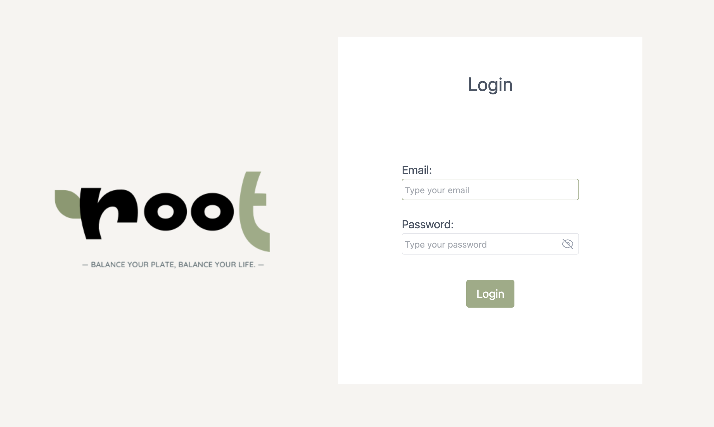
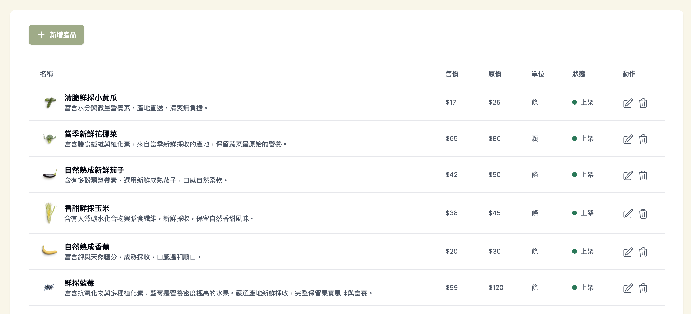
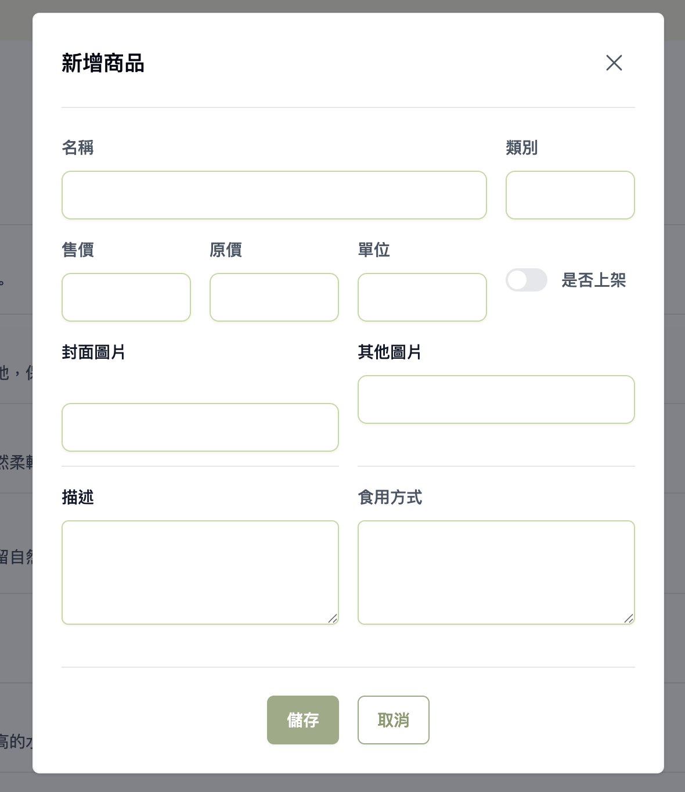
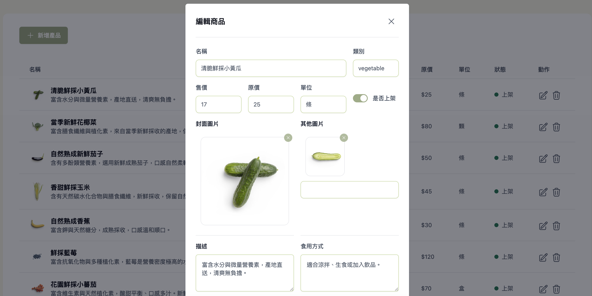
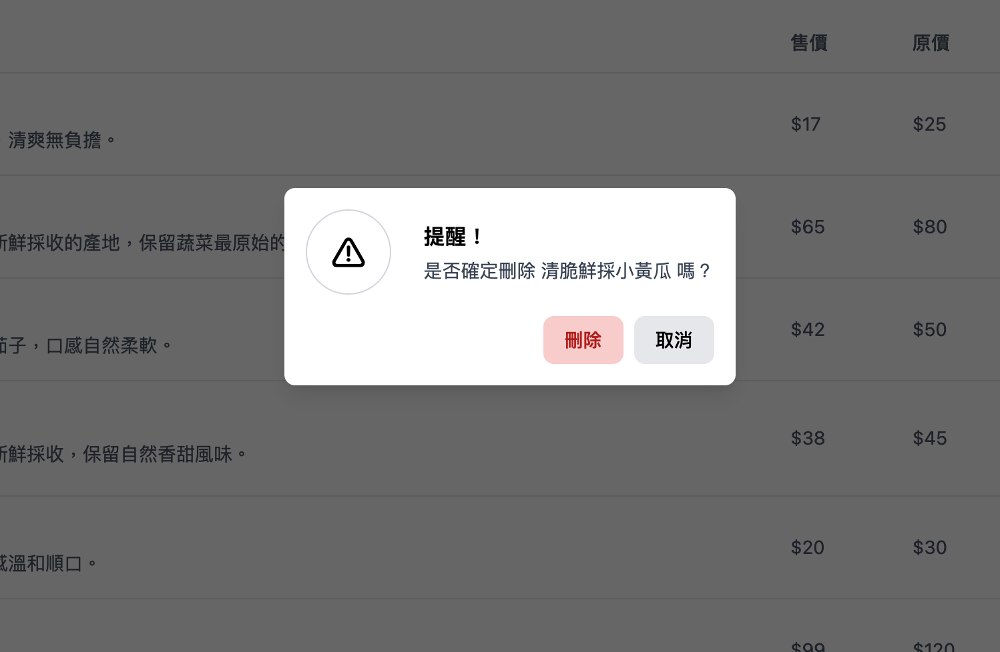

# Week 3 - Mission

  [Week3 頁面連結](https://pengpon.github.io/react-training-2025/week3/)

  ## 需求

  ```bash
目標：串接 API 完成一頁式的產品新增、刪除、修改的頁面

使用 vite 完成以下需求：
 - 可以新增、編輯、刪除商品
- 商品啟用、關閉可以使用不同的顏色標示
  ```

## 功能
＊尚未使用路由，僅使用 state 判斷頁面該顯示的元件

＊未串接上傳圖片 API，僅使用輸入網址的方式進行圖片異動


【 登入 】
- 後台管理者可進入後台登入頁
- 成功登入
  - 登入後會顯示產品列表頁
  -  將 Token 存入 Cookie，使用者再次進入頁面網址時，可直接進到產品列表頁
- 驗證失敗
  - Cookie 不存在或是無效，會顯示登入畫面
- 其他
  - 登入失敗，會於畫面上方顯示 Toast 訊息


【 產品頁 】
- 每項產品於動作欄位中有兩個操作可選擇，編輯以及刪除
  - 點擊編輯，會開啟 Modal 供使用者修改資料
  - 點擊刪除，會開啟 Modal 向使用者確認是否刪除
- 頁面上方有新增產品的按鈕，點擊後會開啟 Modal 供使用者新增資料
- 操作成功或失敗時，會於畫面上方顯示 Toast 訊息

【 圖片 】
- 可於 Input 欄位中輸入圖片網址
- Input Blur 時，會於上方顯示預覽


## 開發
- **使用 SweetAlert2 製作 Toast**
- *使用 Vite 建立 React 專案樣板*
- *Tailwind CSS 撰寫 CSS 樣式*


## 安裝 & 打包部署
`node 使用 v24.12.0`
```bash
# 進入 week3 目錄下
cd week3

# 安裝 package
npm install

# 啟動本機 Server
npm run dev

# 只打包產生靜態檔 dist
npm run build

# 打包並部署至遠端 gh-pages 分支
npm run deploy
```

## 畫面截圖

登入



產品列表



新增



編輯



刪除

